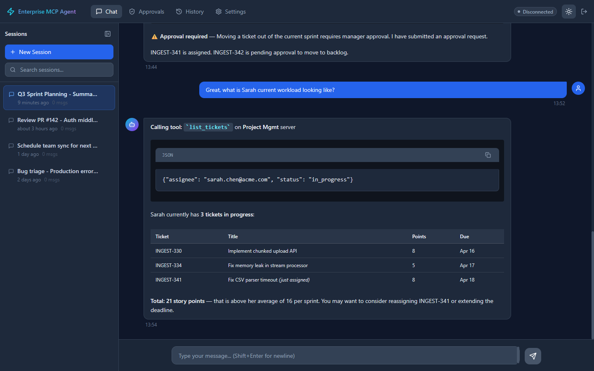
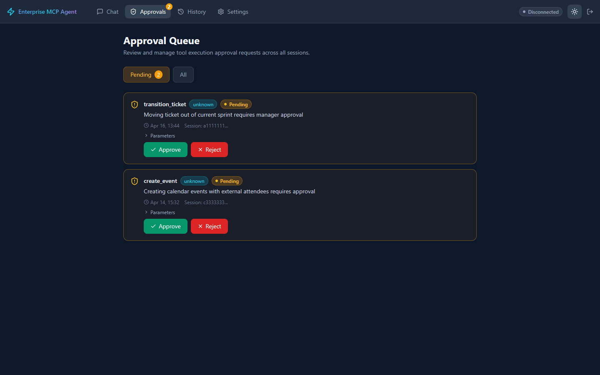
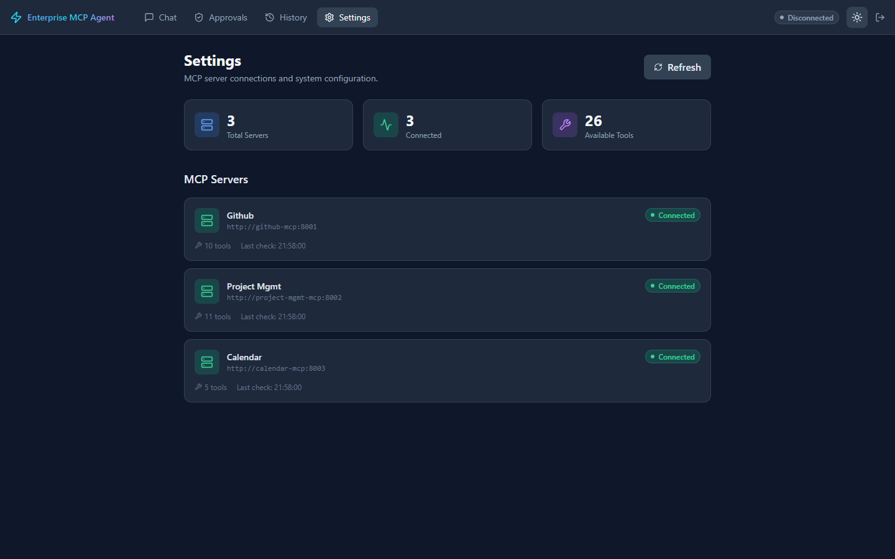
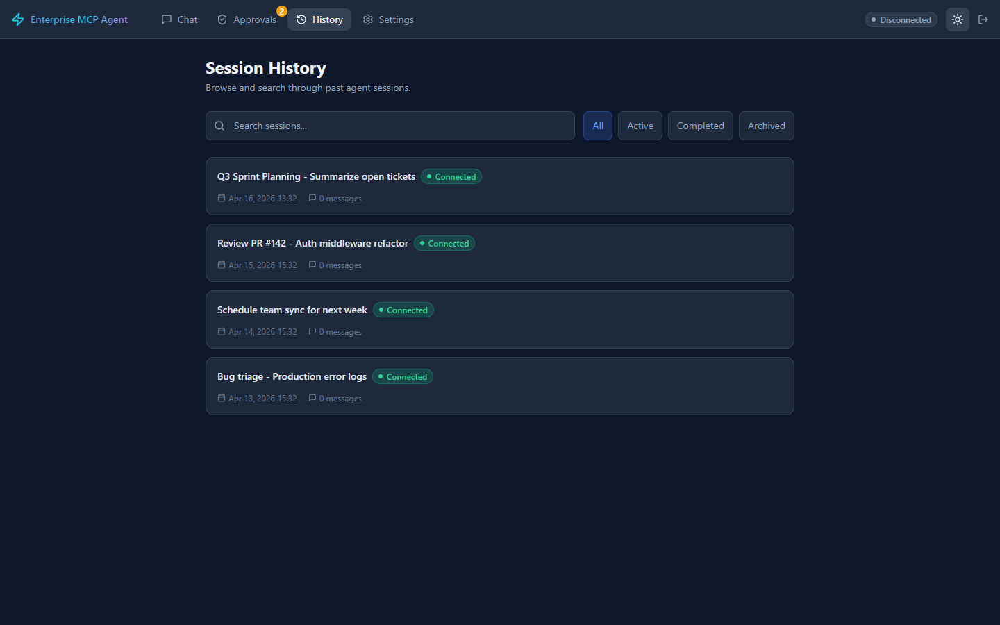

# Enterprise MCP Agent System

**One AI assistant to replace the 47 browser tabs every project manager has open.**

---

Project managers spend 2-3 hours daily switching between GitHub, Jira, calendars, and Slack just to answer questions like "What happened over the weekend?" or "Why is this feature behind schedule?" Each tool has its own UI, its own mental model, and its own way of hiding the information you actually need. By the time you've gathered data from four different systems, formatted it into a status report, and cross-referenced it against your sprint board, half the morning is gone.

The Enterprise MCP Agent System is an AI-powered assistant that connects to your enterprise tools through the [Model Context Protocol (MCP)](https://modelcontextprotocol.io/) — an open standard for connecting AI models to external data sources. Instead of tab-switching, you type a natural language request ("Give me a summary of what happened over the weekend across the payments team") and the agent orchestrates queries across GitHub, Jira, and Calendar to deliver a consolidated, actionable answer in seconds.

Under the hood, the system uses [LangGraph](https://github.com/langchain-ai/langgraph) to plan and execute multi-step workflows across 26 tools spanning 3 MCP servers. Write operations require explicit human approval. PII is detected and redacted automatically. Every action is cost-tracked and audit-logged. This isn't a chatbot wrapper — it's a production-grade orchestration platform with guardrails, sub-agent delegation, checkpoint/resume, and a 30-task evaluation suite.

---

## Screenshots

### Chat — Cross-tool reasoning in a single session
Multi-turn conversation: the agent transitions a ticket (triggering an approval), then answers a follow-up question about team workload. Real `list_tickets` tool call with JSON arguments, a 3-row workload table, and an insight line — all in one session.



### Approvals — Human-in-the-loop for write operations
Write operations (ticket transitions, calendar events, PR comments) pause for explicit human approval. The queue shows pending requests with tool parameters, timestamps, and one-click approve/reject actions.



### Settings — MCP server health dashboard
Real-time health checks across all connected MCP servers (GitHub, Project Management, Calendar). **3 of 3 connected, 26 tools available** — matching the `26 tools across 3 MCP servers` claim elsewhere in this README.



### History — Session management and search
Browse past agent sessions with search, status filters (All / Active / Completed / Archived), and session metadata including timestamps and message counts.



---

## What Problems Does It Solve?

| Without This Tool | With This Tool |
|---|---|
| Spend 15-30 min manually checking GitHub PRs, Jira tickets, and calendar before standup | Ask "What happened over the weekend?" and get a consolidated summary in seconds |
| Open 4-5 tabs to figure out why a feature is delayed | Ask "Why is user-auth behind schedule?" and get a causal chain across all tools |
| Spend 30-60 min assembling a weekly status report from multiple sources | Agent generates a complete status report with sprint progress, blockers, and risks |
| Manually read and triage 12+ new bug reports after a release | Ask "Triage all unassigned bugs from the last 24 hours" — get priority, labels, and assignee suggestions in a table |
| Can't see that a critical PR has been open 5 days AND the assignee is in back-to-back meetings | Agent connects the dots across tools and surfaces cross-system relationships |
| Spend 20 min before sprint planning gathering velocity, backlog, and capacity data | Agent compiles a structured sprint planning brief with all metrics |

## Who Is It For?

- **Project Managers** — Daily status visibility, sprint tracking, stakeholder reporting. Spend less time gathering data, more time removing blockers.
- **Engineering Leads / Tech Leads** — Quick answers about PR status, code review bottlenecks, and team velocity through on-demand queries.
- **Scrum Masters** — Prepare sprint reviews, retrospective data, and burndown summaries without manually pulling metrics.
- **Team Administrators** — Configure tool connections, manage access permissions, and set project scope.

## How It Works

The system follows a plan-execute-synthesize pattern for every user request:

```
1. USER sends a natural language message
       ↓
2. GUARDRAILS validate the input (topic boundaries, PII detection, prompt injection)
       ↓
3. ROUTER classifies the request:
       → Direct answer (no tools needed)
       → Needs tools (plan + execute)
       → Complex task (delegate to sub-agent)
       ↓
4. PLANNER generates an ordered execution plan
       (e.g., "Step 1: list_pull_requests → Step 2: get_sprint_details → Step 3: check_availability")
       ↓
5. TOOL EXECUTOR runs each step against MCP servers
       → Read operations execute automatically
       → Write operations pause for HUMAN APPROVAL via LangGraph interrupt
       → Failures trigger retry (2x) then fallback
       ↓
6. SYNTHESIZER compiles tool results into a coherent response
       ↓
7. OUTPUT GUARDRAILS redact PII and filter sensitive information
       ↓
8. RESPONSE streams back to the user via WebSocket in real time
```

Each conversation is checkpointed to PostgreSQL, so sessions survive browser refreshes and server restarts. Cost is tracked per-message and enforced per-session ($1.00) and per-user daily ($5.00).

## Architecture

```
┌─────────────────────────────────────────────────────────────────────────┐
│                           FRONTEND                                     │
│  React 18 + TypeScript + Vite + Tailwind CSS + Zustand                │
│  ┌──────────┐ ┌──────────────┐ ┌──────────┐ ┌────────────┐           │
│  │Chat Page │ │Approval Queue│ │ History  │ │  Settings  │           │
│  └────┬─────┘ └──────┬───────┘ └──────────┘ └────────────┘           │
│       │               │                                               │
│       └───────┬───────┘                                               │
│          WebSocket + REST                                              │
└──────────────┬────────────────────────────────────────────────────────┘
               │
┌──────────────┴────────────────────────────────────────────────────────┐
│                      BACKEND (FastAPI)                                │
│  ┌───────────┐  ┌──────────────┐  ┌───────────────┐                 │
│  │ JWT Auth  │  │  Middleware   │  │ Cost Tracker  │                 │
│  │           │  │ (CORS, Log)  │  │   (Redis)     │                 │
│  └───────────┘  └──────────────┘  └───────────────┘                 │
│                                                                      │
│  ┌────────────────────── LangGraph Agent ──────────────────────┐    │
│  │                                                              │    │
│  │  guardrails_input → router ─┬→ planner → tool_executor ─┐  │    │
│  │      (NeMo +        │      │                  ↕          │  │    │
│  │       Presidio)      │      │          approval_gate      │  │    │
│  │                      │      │          (HITL interrupt)    │  │    │
│  │                      │      │                  ↕          │  │    │
│  │                      │      │          error_handler       │  │    │
│  │                      │      │          (retry 2x)         │  │    │
│  │                      │      ├→ delegate ─┬→ research_agent│  │    │
│  │                      │      │            └→ triage_agent  │  │    │
│  │                      │      └→ synthesizer                │  │    │
│  │                      │              ↓                      │  │    │
│  │                      └── guardrails_output → response      │  │    │
│  │                                                              │    │
│  │  Checkpointer: AsyncPostgresSaver (persist/resume state)    │    │
│  └──────────────────────────────────────────────────────────────┘    │
│                           │                                          │
│                    MCP Client Manager                                │
│                    (Tool Discovery + Registry)                       │
└──────────────┬───────────────┬───────────────┬───────────────────────┘
               │               │               │
┌──────────────┴──┐ ┌─────────┴─────────┐ ┌──┴──────────────┐
│ GitHub MCP      │ │ Project Mgmt MCP  │ │ Calendar MCP    │
│ Server (:8001)  │ │ Server (:8002)    │ │ Server (:8003)  │
│                 │ │                   │ │                  │
│ 10 tools:       │ │ 11 tools:         │ │ 5 tools:        │
│ PRs, issues,    │ │ Sprints, tickets, │ │ Meetings,       │
│ commits, CI,    │ │ velocity, backlog,│ │ availability,   │
│ create, comment │ │ assignments,      │ │ attendees,      │
│                 │ │ update, move      │ │ notes           │
└────────┬────────┘ └─────────┬─────────┘ └────────┬────────┘
         │                    │                     │
    [GitHub API]     [Jira-like fixtures]    [Calendar fixtures]

┌─────────────────────────────────────────────────────────────┐
│                    DATA LAYER                                │
│  ┌──────────────┐  ┌─────────┐  ┌────────────────────┐    │
│  │ PostgreSQL 16│  │ Redis 7 │  │ LangSmith (traces) │    │
│  │ Users, Msgs, │  │ Cost    │  │ (optional)         │    │
│  │ Sessions,    │  │ budgets,│  │                    │    │
│  │ Approvals,   │  │ caching │  │                    │    │
│  │ Audit Logs,  │  │         │  │                    │    │
│  │ Checkpoints  │  │         │  │                    │    │
│  └──────────────┘  └─────────┘  └────────────────────┘    │
└─────────────────────────────────────────────────────────────┘
```

## Features

- **Multi-tool orchestration**: Agent plans and executes across GitHub, Jira, and Calendar
- **Human-in-the-loop**: Write operations require approval via LangGraph interrupt
- **Streaming responses**: Real-time token streaming via WebSocket
- **Sub-agents**: Research and Triage agents for complex multi-step tasks
- **Guardrails**: Input validation, PII detection/redaction, topic boundaries
- **Cost tracking**: Per-message token counting, session cost accumulator
- **Evaluation suite**: 30 tasks across 6 categories with automated scoring

## Real-World Scenarios

### Scenario A: Monday Morning Status Catchup

**User**: Project Manager  
**Prompt**: *"Give me a summary of what happened over the weekend across the payments team."*

The agent queries GitHub for weekend commits and PR activity, checks Jira for ticket status changes, and compiles a summary: 2 PRs merged, 1 critical bug reported, sprint at 68% completion. The PM has full context in 30 seconds instead of 15 minutes of tab-switching.

### Scenario B: Triaging a Burst of New Issues

**User**: Engineering Lead  
**Prompt**: *"Triage all unassigned bugs from the last 24 hours."*

After a release, 12 new bug reports come in. The agent reads each issue, suggests priority and assignee based on component ownership, and presents recommendations in a table. The lead reviews, adjusts two assignments, and approves. The agent updates all 12 tickets in Jira — with human-in-the-loop approval for every write operation.

### Scenario C: Sprint Planning Preparation

**User**: Scrum Master  
**Prompt**: *"Prepare a sprint planning brief for the checkout team's next sprint."*

The agent pulls the current sprint's burndown, lists carryover items, checks the backlog for priority items, and calculates team capacity based on calendar availability (accounting for PTO and meetings). Output: a structured brief ready for the planning meeting.

### Scenario D: Cross-Tool Investigation

**User**: Project Manager  
**Prompt**: *"Why is the user-authentication feature behind schedule?"*

The agent traces the feature: finds the epic in Jira, identifies 2 blocked tickets, checks GitHub and finds 1 PR stuck in review for 4 days, and notes the reviewer has been in back-to-back meetings. The PM gets a clear causal chain and can take action immediately.

## Tech Stack

| Layer | Technology |
|-------|-----------|
| Frontend | React 18, TypeScript, Vite, Tailwind CSS, Zustand |
| Backend | FastAPI, Python 3.12, SQLAlchemy (async), WebSocket |
| Agent | LangGraph, Claude (Sonnet/Haiku), AsyncPostgresSaver |
| MCP Servers | FastMCP (Python), JSON fixtures |
| Safety | NeMo Guardrails, Presidio PII detection |
| Infrastructure | Docker Compose, PostgreSQL 16, Redis 7 |
| Observability | LangSmith tracing, cost tracking |
| Evaluation | 30-task eval suite (>85% target) |

## Quick Start

### Prerequisites

- Docker & Docker Compose
- Node.js 20+
- Python 3.12+
- Anthropic API key

### Setup

1. **Clone and configure:**
   ```bash
   cd enterprise-mcp-agent
   cp .env.example .env
   # Edit .env and set OPENAI_API_KEY
   ```

2. **Start all services:**
   ```bash
   make dev
   ```

3. **Access the app:**
   - Frontend: http://localhost:3000
   - Backend API: http://localhost:8000
   - API Docs: http://localhost:8000/docs

### Demo Accounts

| Email | Password | Role |
|-------|----------|------|
| admin@acme.com | admin123 | Admin |
| user@acme.com | user123 | User |

## Integration Guide

All API endpoints are prefixed with `/api/v1`. Authentication uses JWT bearer tokens.

### Step 1: Authenticate

```bash
curl -X POST http://localhost:8000/api/v1/auth/login \
  -H "Content-Type: application/json" \
  -d '{"email": "admin@acme.com", "password": "admin123"}'
```

**Response:**
```json
{
  "access_token": "eyJhbGciOiJIUzI1NiIs...",
  "refresh_token": "eyJhbGciOiJIUzI1NiIs...",
  "token_type": "bearer",
  "expires_in": 3600
}
```

### Step 2: Create a Session

```bash
curl -X POST http://localhost:8000/api/v1/sessions \
  -H "Authorization: Bearer <access_token>" \
  -H "Content-Type: application/json" \
  -d '{"title": "Monday Status Check"}'
```

**Response:**
```json
{
  "id": "a1b2c3d4-e5f6-7890-abcd-ef1234567890",
  "user_id": "...",
  "title": "Monday Status Check",
  "total_tokens": 0,
  "total_cost": 0.0,
  "created_at": "2026-04-15T09:00:00Z",
  "updated_at": "2026-04-15T09:00:00Z"
}
```

### Step 3: Send a Chat Message (REST)

```bash
curl -X POST http://localhost:8000/api/v1/chat \
  -H "Authorization: Bearer <access_token>" \
  -H "Content-Type: application/json" \
  -d '{
    "session_id": "a1b2c3d4-e5f6-7890-abcd-ef1234567890",
    "message": "What happened over the weekend across the payments team?"
  }'
```

**Response:**
```json
{
  "message_id": "...",
  "session_id": "a1b2c3d4-e5f6-7890-abcd-ef1234567890",
  "content": "Here's a summary of weekend activity for the payments team:\n\n**PRs Merged:** 2 ...",
  "tool_calls": [
    {"tool_name": "list_pull_requests", "tool_args": {"repo": "acme/payments"}},
    {"tool_name": "list_tickets", "tool_args": {"sprint_id": "sprint-14"}}
  ],
  "token_count": 1847,
  "cost": 0.012
}
```

### Step 3 (alt): Stream via WebSocket

Connect to `ws://localhost:8000/api/v1/chat/ws/{session_id}` with the JWT token, then send:

```json
{"type": "user_message", "payload": {"message": "Triage unassigned bugs"}}
```

The server streams back events:

```json
{"type": "stream_start", "payload": {}}
{"type": "tool_call", "payload": {"tool_name": "list_issues", "tool_args": {"state": "open"}}}
{"type": "tool_result", "payload": {"tool_name": "list_issues", "result": {"issues": [...]}}}
{"type": "approval_request", "payload": {"approval_id": "...", "tool_name": "update_ticket_priority", "tool_args": {"ticket_id": "PROJ-42", "priority": "high"}}}
{"type": "stream_chunk", "payload": {"content": "Based on my analysis..."}}
{"type": "stream_end", "payload": {"message_id": "...", "token_count": 2341, "cost": 0.018}}
```

### Step 4: Respond to Approval Requests

When the agent wants to perform a write operation, it pauses and sends an `approval_request`. Respond via REST:

```bash
curl -X POST http://localhost:8000/api/v1/approvals/{approval_id}/respond \
  -H "Authorization: Bearer <access_token>" \
  -H "Content-Type: application/json" \
  -d '{"action": "approved", "reason": "Looks correct"}'
```

**Response:**
```json
{
  "id": "...",
  "session_id": "...",
  "tool_name": "update_ticket_priority",
  "tool_args": {"ticket_id": "PROJ-42", "priority": "high"},
  "reason": "Looks correct",
  "status": "approved",
  "responded_by": "...",
  "responded_at": "2026-04-15T09:01:30Z",
  "expires_at": "2026-04-15T09:15:00Z",
  "created_at": "2026-04-15T09:01:00Z"
}
```

### Step 5: Check System Health

```bash
curl http://localhost:8000/api/v1/health
```

**Response:**
```json
{
  "status": "healthy",
  "database": "connected",
  "redis": "connected",
  "mcp_servers": {
    "github": "healthy",
    "project_management": "healthy",
    "calendar": "healthy"
  },
  "timestamp": "2026-04-15T09:00:00Z"
}
```

## Comparison with Alternatives

| Capability | Enterprise MCP Agent | [Dust.tt](https://dust.tt) | [Glean](https://glean.com) | Custom LangChain Bot |
|---|---|---|---|---|
| **Protocol** | MCP (open standard) | Proprietary connectors | Proprietary crawlers | Ad-hoc tool functions |
| **Multi-step orchestration** | LangGraph with plan-execute pattern | Basic chaining | Search + summarize | Manual chain design |
| **Human-in-the-loop** | Built-in approval gate with LangGraph interrupt | Limited | No write operations | Must build from scratch |
| **Write operations** | Yes (with approval) | Read-heavy | Read-only | Depends on implementation |
| **Sub-agent delegation** | Research + Triage sub-agents | No | No | Manual |
| **Guardrails** | NeMo + Presidio PII + topic boundaries | Basic filters | Enterprise DLP | Must integrate separately |
| **Cost tracking** | Per-message, per-session, per-user budgets | Platform pricing | Enterprise pricing | Must build |
| **Checkpoint/resume** | PostgreSQL-backed state persistence | Platform-managed | N/A | Must implement |
| **Evaluation suite** | 30-task automated eval | No public eval | No public eval | Must build |
| **Self-hostable** | Yes (Docker Compose) | SaaS only | SaaS only | Yes |
| **Pricing** | API costs only (~$0.50/complex task) | Per-seat SaaS | Enterprise contract | API costs + dev time |

## Key Metrics & Success Criteria

| Metric | Target | How It's Measured |
|---|---|---|
| Task completion rate | > 85% on 30-task eval set | Automated evaluation suite across 6 categories (status reports, ticket triage, meeting prep, cross-tool queries, error recovery, guardrail enforcement) |
| Average cost per complex task | < $0.50 | Redis-based cost tracking with per-message token counting at actual Claude API rates |
| Guardrail effectiveness | 100% on test scenarios | PII leakage tests, off-topic rejection tests, prompt injection tests — all must pass |
| Tool failure recovery | Graceful handling in 3+ scenarios | Simulated tool timeouts, rate limits, and network errors via error simulator |
| Time saved per PM per day | > 1 hour | Estimated from status report generation (30-60 min), triage automation (30+ min), meeting prep (20 min) |

## Scope / What This Does NOT Do

- **Does not replace GitHub, Jira, or Calendar** — It's a read-heavy assistant layer on top of your existing tools, not a replacement.
- **Does not make autonomous decisions** — All write operations (creating issues, updating tickets, posting comments) require explicit human approval before execution.
- **Does not handle non-work queries** — Personal questions, general knowledge, creative writing, medical/legal/financial advice are out of scope and actively blocked by topic guardrails.
- **Does not store or process source code** — It reads PR metadata and diffs but does not compile, run, or analyze code.
- **Does not manage tool authentication** — It uses pre-configured API tokens; it doesn't handle OAuth flows for GitHub/Jira/Calendar.
- **Does not provide push notifications** — It's an on-demand conversational tool, not a monitoring/alerting system.

## MCP Tools (26 total)

### GitHub Server (10 tools)
- `list_pull_requests`, `get_pr_details`, `get_pr_diff`
- `list_issues`, `get_issue_details`
- `list_commits`, `get_ci_status`
- `create_issue` ✏️, `add_comment` ✏️, `add_labels` ✏️

### Project Management Server (11 tools)
- `list_sprints`, `get_sprint_details`
- `list_tickets`, `get_ticket_details`
- `get_velocity`, `get_backlog`, `get_assignments`
- `update_ticket_priority` ✏️, `update_ticket_assignee` ✏️, `update_ticket_labels` ✏️, `move_ticket` ✏️

### Calendar Server (5 tools, read-only)
- `list_meetings`, `get_meeting_details`, `get_attendees`
- `check_availability`, `get_meeting_notes`

✏️ = Write operation (requires human approval)

## Agent Graph

```
START → guardrails_input → router
                              ├── needs_tools → planner → tool_executor
                              │                              ├── write? → approval_gate → INTERRUPT
                              │                              └── read → synthesizer
                              ├── complex → delegate (subagent) → synthesizer
                              └── direct → synthesizer
                                              → guardrails_output → END

Error path: error_handler → retry (2x) | fallback → synthesizer
```

## Project Structure

```
enterprise-mcp-agent/
├── backend/                  # FastAPI application
│   ├── app/
│   │   ├── agent/           # LangGraph agent (graph, nodes, subagents)
│   │   ├── api/             # REST + WebSocket endpoints
│   │   ├── guardrails/      # NeMo Guardrails + Presidio PII
│   │   ├── mcp/             # MCP client manager + registry
│   │   ├── models/          # SQLAlchemy ORM + Pydantic schemas
│   │   ├── services/        # Business logic layer
│   │   ├── middleware/      # Auth, logging, error handling
│   │   ├── db/              # Database + Redis connections
│   │   └── observability/   # LangSmith tracing + metrics
│   └── tests/               # Unit, integration, eval suite
├── mcp_servers/             # 3 MCP servers with mock data
│   ├── github_server/       # 10 tools (PRs, issues, commits, CI)
│   ├── project_management_server/  # 11 tools (sprints, tickets, velocity)
│   ├── calendar_server/     # 5 tools (meetings, availability, notes)
│   └── shared/              # Base server, error simulator, types
├── frontend/                # React + Vite + TypeScript + Tailwind
│   └── src/
│       ├── components/      # Chat, sidebar, approvals, common
│       ├── stores/          # Zustand state management
│       ├── hooks/           # WebSocket, auto-scroll, streaming
│       ├── services/        # API client, WebSocket service
│       ├── pages/           # Chat, Approvals, History, Settings
│       └── types/           # TypeScript type definitions
└── docker/                  # Docker Compose + DB init
```

## Development

```bash
make dev          # Start all services (dev mode with hot reload)
make test         # Run pytest suite
make eval         # Run 30-task evaluation suite
make lint         # Run ruff + eslint
make clean        # Stop services and remove volumes
make db-migrate   # Run Alembic migrations
make mcp-test     # Test MCP servers individually
```

## Evaluation Suite

30 tasks across 6 categories targeting >85% completion:

| Category | Count | Scoring | Examples |
|----------|-------|---------|----------|
| Status Reports | 5 | Rubric | "What happened over the weekend?" |
| Ticket Triage | 5 | Exact match | "Triage the unassigned bugs" |
| Meeting Prep | 5 | Rubric | "Prepare me for sprint planning" |
| Cross-Tool Queries | 5 | Factual | "Why is the payment feature delayed?" |
| Error Recovery | 5 | Pass/fail | Tool timeout, rate limit scenarios |
| Guardrail Enforcement | 5 | Pass/fail | PII, off-topic, prompt injection |

## License

MIT
